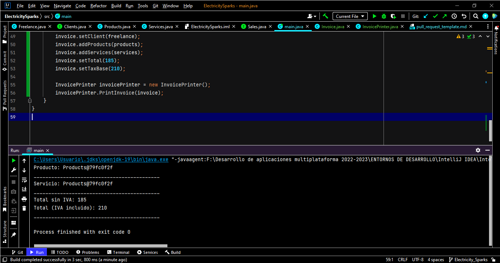

## Description de la tarea

<!-- Descripción sobre lo que se pide en la tarea--> Se pide informatizar una empresa sabiendo que tiene clientes autónomos y empresas. Quieren crear facturas y poder imprimirlas asi como editar las clases anteriormente mencionadas.

## ¿Cómo se ha implementado?
Se han creado, por una parte, las clases autonomo y sociedad e implementado en la interfaz clients. Por otra parte, las clases productos y servicios e implementado en ventas. Por último las clases factura e impresion de factura.

<!-- Estructura de clases, patrones: MVVM, etc. -->

## Keywords
Clase, interfaz.
<!-- Palabras relacionadas con los conceptos vistos -->

## Screenshots or Video

<!-- Captura de pantalla de la consola -->

## Disclaimer

## Objetivos

<!-- Lo actualiza el profesor.. 
Buscar en el README el Resultado de Aprendizaje con el que se está trabajando -->

## Criterios de Evaluación

<!-- 
    Lo actualiza el profesor.
    Buscar en el README los criterios de Evaluación con los que se están trabajando.
    Marca con una [X] los conseguidos. Ejemplo:
    [ ] Criterio Evaluación 1.
    [ ] Criterio Evaluación 2.
    [X] Criterio Evaluación 3.S
-->